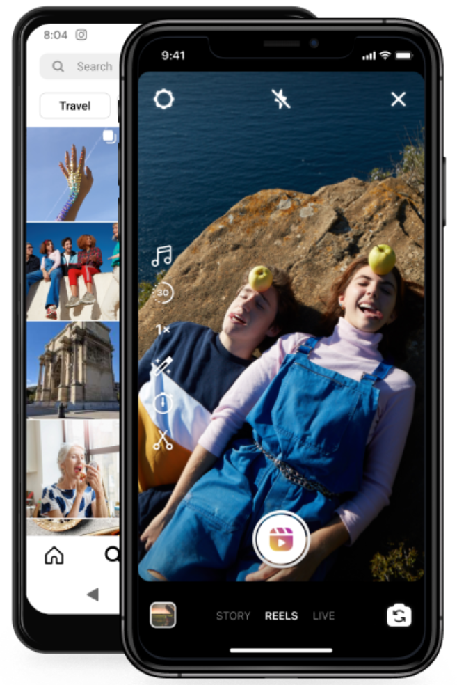

# 📱 Instagram Login Clone - Tela de Autenticação

[](https://developer.mozilla.org/pt-BR/docs/Web/HTML)

[](https://developer.mozilla.org/pt-BR/docs/Web/CSS)

[]()

[]()

---



Você pode ver o projeto em funcionamento [aqui](https://insta-login-page-xi.vercel.app/) 

---

## 📋 Descrição

Este é um projeto front-end que reproduz a interface de login do **Instagram**, com foco em design responsivo e uso de HTML5 e CSS3. O layout inclui a tela de login, opções de login com o Facebook, recuperação de senha, sugestão de cadastro e botões para baixar o aplicativo mobile.
📌 Observação! Este projeto é apenas para fins educacionais, sem qualquer vínculo com a empresa Meta/Instagram.

---

## 🧰 Tecnologias Utilizadas

- **HTML5**
- **CSS3**
- **Flexbox**
- **Media Queries** para responsividade

---

## 💡 Funcionalidades

- Tela de login com campos de entrada
- Login com Facebook (simulado)
- Link para recuperação de senha
- Sugestão de criação de conta
- Botões para baixar o app na App Store e Google Play
- Rodapé com links institucionais
- Design responsivo para dispositivos móveis

---

## 📱 Responsividade

✅ O layout adapta-se perfeitamente para diferentes dispositivos (celulares, tablets, desktops) utilizando `media queries` e `flexbox`.

---

## 🚀 Como Visualizar

Clone o repositório e abra o arquivo `index.html` no navegador:

```bash
git clone https://github.com/lauraserbeto/instagram-login-clone.git
cd instagram-login-clone
